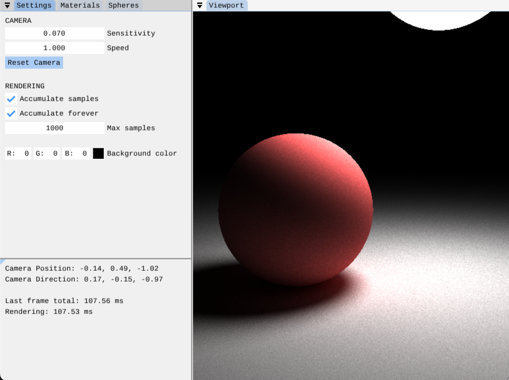

Work-in-progress interective path tracer written in C++. Uses OpenGL and [Dear ImGui](https://github.com/ocornut/imgui) for the interface.

Currently supports camera control and basic rendering of spheres, but the end-goal is a physically based renderer.

